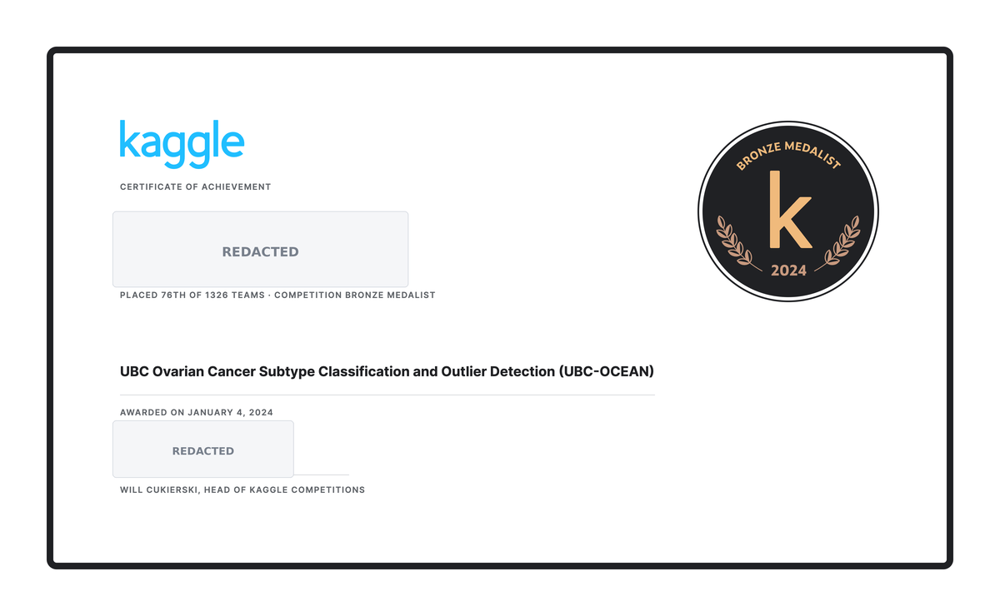
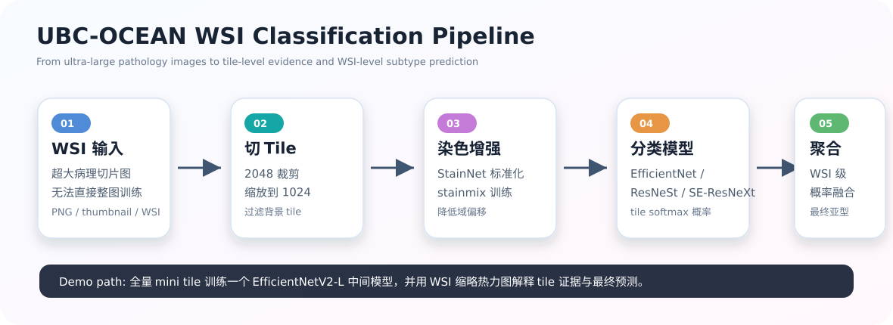
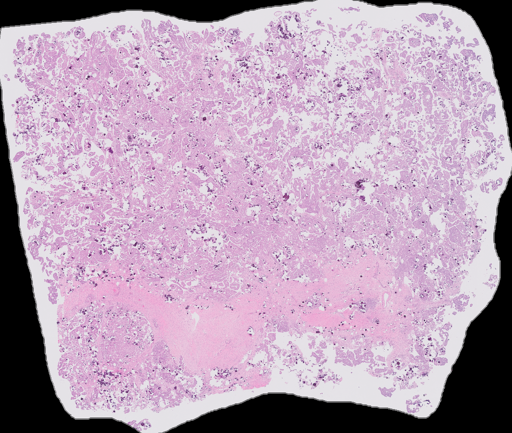
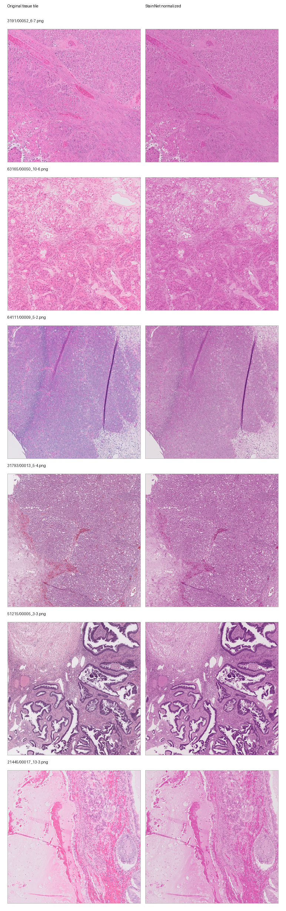
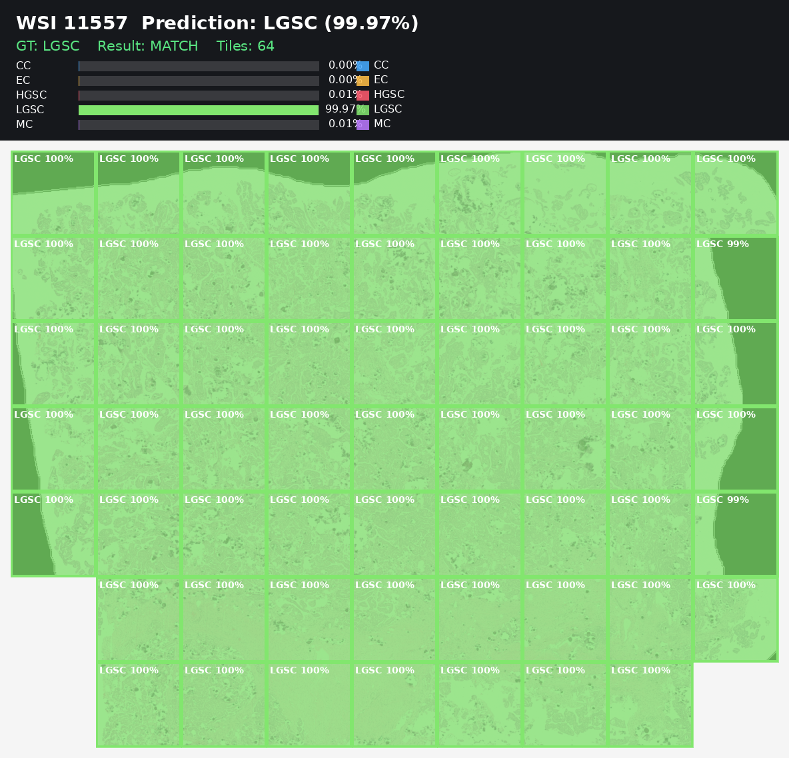
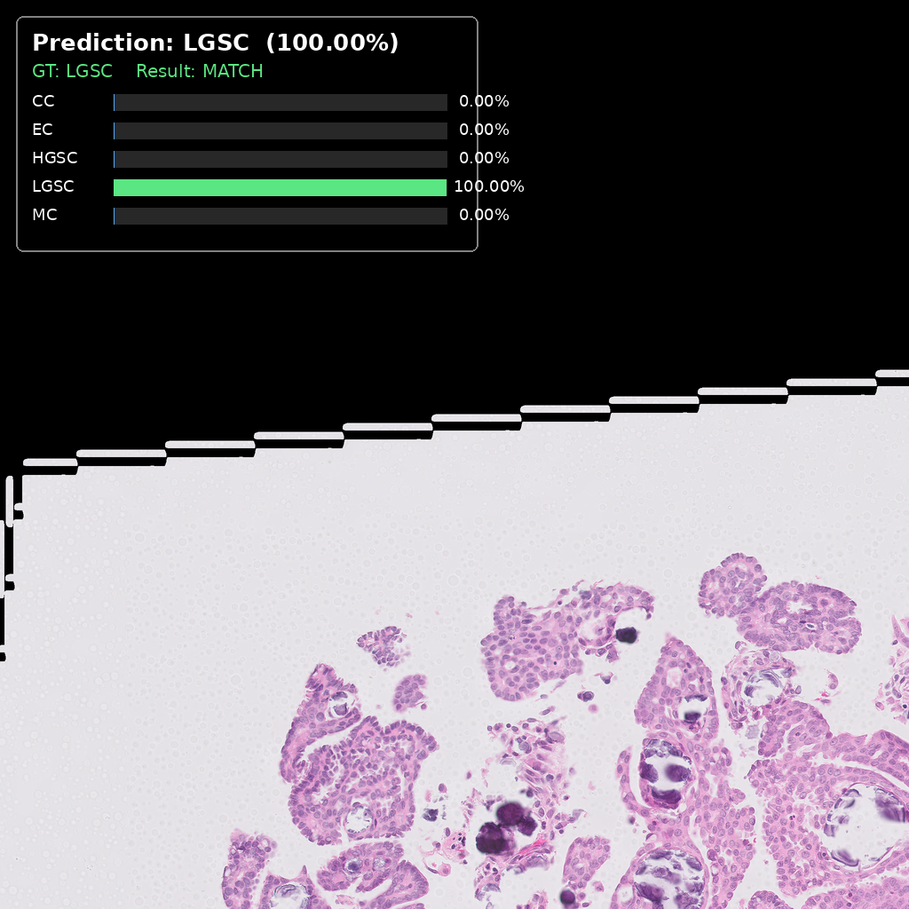

# UBC-OCEAN 卵巢癌亚型分类 Demo

本项目整理了 Kaggle **UBC Ovarian Cancer Subtype Classification and Outlier Detection (UBC-OCEAN)** 的思路、局部复现实验和可视化结果。竞赛任务是基于超大尺寸病理切片图像，判断卵巢癌组织学亚型，并识别异常样本。

正式竞赛方案取得 **铜牌**，截图记录为 **1326 支队伍中排名第 76**，约 **Top 5.7%**。本目录中的代码不是完整复现最终提交系统，而是包含：

<p align="center">
  
</p>

> 证书图已对个人姓名和签名区域打码，仅保留比赛、名次和奖牌信息。

- 一个可运行的本地 mini demo。
- 一个中间模型 `EfficientNetV2-L` 的训练流程。
- 单 tile 和 WSI 级推理可视化。
- 原始 Kaggle 推理脚本 `src/Inference.py`，保留了 3 模型 ensemble 的主要推理逻辑。

## 项目背景

UBC-OCEAN 的输入是 Whole Slide Image (WSI)，即整张数字病理切片。单张图像可能达到数万像素宽高，无法直接作为普通 CNN 的输入。因此这类任务通常不会直接整图训练，而是采用 **Multi-Instance Learning / tile-based classification** 思路：

1. 将 WSI 切成多个局部 tile。
2. 对背景过多的 tile 做过滤。
3. 对每个 tile 做分类模型训练或推理。
4. 将同一张 WSI 下所有 tile 的预测结果聚合，得到 WSI 级别亚型。

这里的难点是：**标签是 WSI 级标签，不是 tile 级标签**。也就是说，某个 tile 继承了整张 WSI 的标签，但它本身未必包含足够的诊断区域。因此单个 tile 的预测只能作为局部证据，最终更应该看整张 WSI 的聚合结果。

## Pipeline



整体流程如下：

```text
超大 WSI
  -> 切成 2048 patch
  -> 缩放为 1024 tile
  -> 过滤背景
  -> StainNet 染色标准化 / stainmix
  -> 分类模型训练
  -> tile 级概率
  -> WSI 级概率聚合
  -> 最终亚型预测
```

`src/` 下是源码脚本。`dataset/`、`save/`、`outputs/` 分别保存数据、模型权重和可视化输出。

## 我们的算法

### 正式竞赛思路

正式方案使用的是 tile-based ensemble：

- **切图**：使用 `pyvips` 读取超大 WSI，按区域裁剪 tile，避免整图读入内存。
- **背景过滤**：剔除白背景或黑背景占比过高的 tile。
- **染色增强**：使用 StainNet 做染色标准化，缓解不同医院、扫描设备和染色流程带来的颜色域偏移。
- **模型训练**：对原始 tile 和染色增强 tile 做端到端分类训练。
- **模型集成**：原始 `src/Inference.py` 中包含 3 个模型：
  - `resnest200e`
  - `tf_efficientnetv2_s`
  - `seresnextaa101d_32x8d`
- **WSI 聚合**：每个模型对一张 WSI 的多个 tile 分别推理，然后对 tile 概率做累积，得到 WSI 级分类结果。

正式推理脚本中的聚合方式更接近“累计证据分数”：

```python
preds = np.sum(tile_probs, axis=0)
label = np.argmax(preds)
```

这里的分数不是严格 0-1 概率，而是多个 tile 对同一类别的累计支持。

### 本仓库 Demo

本仓库当前本地 demo 训练的是一个中间模型：

```text
tf_efficientnetv2_l.in21k_ft_in1k
```

训练脚本：

```text
src/train_tf_efficientnetv2_l_tilex1024_stainmix_full_demo.py
```

训练使用当前 mini 数据里的全部 505 个 tile，不再单独划分验证集。原因是 mini 数据只有 10 张 WSI，按 fold 切分后每个验证集只有 2 张 WSI，验证指标波动很大，不适合作为可靠泛化评估。因此这个脚本更适合作为 **demo 和流程检查**。

已训练权重：

```text
save/full_demo/tf_efficientnetv2_l.in21k_ft_in1k_bestTrainLoss_imgsize_1024_full.pt
save/full_demo/tf_efficientnetv2_l.in21k_ft_in1k_final_ep15_imgsize_1024_full.pt
```

训练结果：

```text
Epochs: 15
Final Train Loss: 0.105
Final Train Acc: 0.960
Final Train Recall: 0.942
Best Train Loss: 0.0918
```

这个结果说明 demo 模型已经能拟合当前 mini tile 数据，但不能代表正式泛化能力。

## 可视化说明

### 1. 原始图像

下图是 `image_id=11557` 的原始 WSI 缩略图。真实全分辨率 WSI 太大，README 中用 thumbnail 展示整体组织分布。



原始 WSI 不能直接送入普通 CNN，所以需要切成 tile 后训练和推理。

### 2. StainNet Tissue Comparison 的作用

不同病理中心、扫描仪和染色流程会导致颜色分布差异。StainNet 的作用是把 tile 的染色风格拉到更一致的分布，从而降低训练集和测试集之间的颜色域偏移。

下面的对比图展示了组织区域在染色标准化前后的效果：



在训练中，我们把原始 tile 和 StainNet 处理后的 tile 混合使用，形成 stainmix 数据增强。这比只使用原始 tile 更稳健。

### 3. 最终 WSI 级结果

单个 tile 很难可靠判断肿瘤亚型，因此本地 demo 提供了 WSI 级缩略图热力图。脚本会对同一张 WSI 的所有 tile 做推理，然后把每个 tile 的局部预测贴回网格，同时在顶部显示整张 WSI 的平均概率和 GT。

示例：



这个例子中：

```text
image_id = 11557
GT       = LGSC
Pred     = LGSC
Tiles    = 64
```

WSI 级概率来自所有 tile softmax 概率的平均：

```python
mean_probs = probs.mean(axis=0)
```

这张图的意义是：不仅看最终类别，还能看到哪些 tile 区域支持该类别。

## 运行示例

### WSI 级可视化

```bash
conda run -n 3t27t python src/infer_full_demo_wsi_thumbnail.py --image-id 11557
```

输出：

```text
outputs/inference_demo/11557_wsi_thumbnail_heatmap.png
```

### 单 Tile 可视化

```bash
conda run -n 3t27t python src/infer_full_demo_one_tile.py
```

输出示例：

```text
outputs/inference_demo/11557_00000_1-1_annotated.png
```



单 tile 图主要用于 sanity check，例如检查模型加载、预处理和类别顺序是否正确。实际亚型判断应优先看 WSI 级聚合。

## 与原始 `src/Inference.py` 的关系

`src/Inference.py` 是 Kaggle 风格的推理脚本，包含：

- `pyvips` 大图切 tile。
- `/kaggle/input` 路径。
- 3 个模型 ensemble。
- 对 test WSI 做推理。

当前本地 demo 使用已经切好的 tile，因此不需要 `pyvips`。本地新增脚本主要用于：

- 加载本地训练出的 EfficientNetV2-L 中间模型。
- 对现有 tile 直接推理。
- 生成单 tile 和 WSI 缩略图可视化。

## 备注

这个目录包含的是 **demo + 中间模型训练**，不是完整铜牌提交方案的全部训练代码。正式比赛方案包含更多模型、更多 fold、更多数据和 ensemble 推理；当前本地版本主要用于讲清楚 pipeline、展示可视化，以及验证中间模型的可运行训练流程。

当前限制：

- mini 数据只有 10 张 WSI、505 个 tile。
- tile 标签是 WSI 弱标签，不是逐 tile 精标。
- 全量 demo 没有独立验证集。
- 当前 WSI 聚合是简单平均，不是完整 MIL/attention pooling。

如果继续推进，建议增加完整数据训练、group-level cross validation、top-k/attention pooling 和多模型 ensemble。
